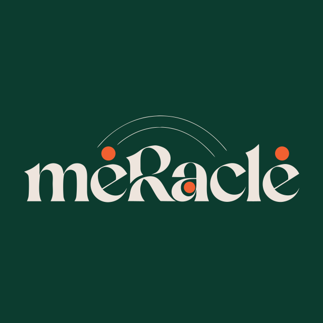

<p align="center">
  
</p>

# meRacle

> Reference Price Oracle for Mercato. An ERC-8004 registered AI agent that scrapes live retailer prices from major grocery and transit operators, then submits them on-chain as trust-weighted reference observations to the Mercato community price index on Celo.

## Why this exists

Mercato is a community-built consumer-price index. Each new country and each new product starts with zero data: the community has to seed it. meRacle solves that cold-start problem by acting as a deterministic, auditable oracle:

1. Scrape live prices from the official sites of major retailers (Novus UA, Sainsbury's UK, Mercadona ES, and more).
2. Submit them to the Mercato PriceOracle contract on Celo Mainnet via `submitPrice()`.
3. Carry an ERC-8004 reputation so the community can verify each observation and weight the agent's submissions accordingly.

## Architecture

- **Runtime**: Node 20 + TypeScript (strict)
- **Chain client**: viem 2.x against Celo Mainnet (`https://forno.celo.org`)
- **Scrapers**: Playwright with retailer-specific modules under `src/retailers/`
- **Schedule**: GitHub Actions cron, daily at 06:00 UTC
- **Identity**: ERC-8004 Identity NFT + ERC-8004 Reputation feedback loop + Self Agent ID

## Trust layer

| Registry | Address on Celo Mainnet | Role |
|---|---|---|
| ERC-8004 Identity Registry | `0x8004A169FB4a3325136EB29fA0ceB6D2e539a432` | Agent NFT, discoverable metadata |
| ERC-8004 Reputation Registry | `0x8004BAa17C55a88189AE136b182e5fdA19dE9b63` | Verifiable feedback on submissions |
| Self Agent ID Registry | `0xaC3DF9ABf80d0F5c020C06B04Cced27763355944` | Sybil-resistant agent ID via Self Protocol |
| Mercato PriceOracle (target) | `0x18DD82604a9439b3Cdb7E1078c355E460ED217Ed` | Where submissions land |

## Live on chain

Concrete proof of work, all on Celo Mainnet (chain ID 42220):

| Asset | Where to look |
|---|---|
| ERC-8004 Identity NFT held by the hot wallet | [erc-721 holdings](https://celoscan.io/address/0x1B94d56f723d8939661D94eD1f899C5c27136b2c#tokentxnsErc721) |
| Self Agent ID NFT `#119` | [mint tx](https://celoscan.io/tx/0x7e6cf552e6514fbd75cc3fa11fb8d2b3c771d5a326d47c49166b4817311e25eb) |
| Daily `submitPrice()` calls signed by the hot wallet | [tx history](https://celoscan.io/address/0x1B94d56f723d8939661D94eD1f899C5c27136b2c) |
| Daily cron that drives the agent | [submit-batch.yml runs](https://github.com/BRN-SLP/meracle/actions/workflows/submit-batch.yml) |
| Public agent metadata | [agent.json](./agent.json) |

## Rollout phases

| Phase | Scope | Status |
|---|---|---|
| 0 | Scaffold, 8004 + Self registration, viem connect | shipped |
| 1 | Novus UA + Sainsbury's UK + Mercadona ES, 6 core products | shipped |
| 2 | + Walmart MX + Auchan FR | pending |
| 3 | + REWE DE + Biedronka PL + Pao de Acucar BR + Pick n Pay ZA + Coles AU | pending |
| 4 | Expand from 3 core products to the full Mercato basket of 33 | pending |
| 5 | Reputation building via community feedback | continuous |

## Quick start

```bash
pnpm install
cp .env.example .env
# Fill AGENT_PRIVATE_KEY, others have safe defaults
pnpm typecheck
```

## Sister project

The on-chain target lives at [github.com/BRN-SLP/mercato](https://github.com/BRN-SLP/mercato). The agent is a separate repository on purpose: cleaner contribution boundary, isolated secrets, independent CI.

## License

MIT, see [LICENSE](./LICENSE).
